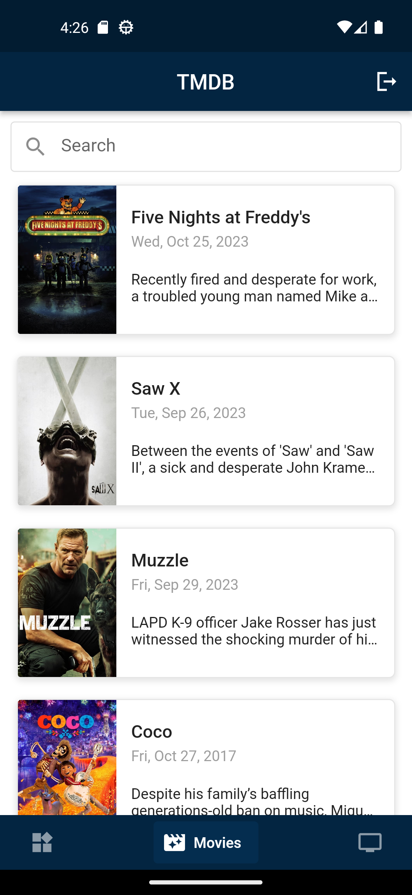

# The Movie DB App

This is my first flutter project

A Flutter app that uses the "[The Movie DB](https://www.themoviedb.org/)" api to fetch popular people and their info (their movies, images, ..etc). [API version 3](https://developer.themoviedb.org/reference/person-popular-list) is used.

## Running the App

An api key from The Movie DB is required to run the app. Then you can run the app by adding the following run arguments:

    class Configuration {
        Configuration._();

        static const host = 'https://api.themoviedb.org/3';
        static const imageUrl = 'https://image.tmdb.org/t/p/w500';
        static const apiKey = '';
    }

## Folder Structure

The code of the app implements clean architecture to separate the UI, domain and data layers.

    lib
    ├── app
    │   ├── api client
    │   ├── configuration
    │   ├── data provider
    │   ├── factories
    │   ├── resources
    │   ├── routes
    │   ├── services
    │   └── app.dart
    │   
    ├── domain
    │   ├── entity
    │   └── local entity
    │   
    ├── presentation
    │   ├── screen
    │   ├── style
    │   ├── theme
    │   └── components
    └── main.dart

